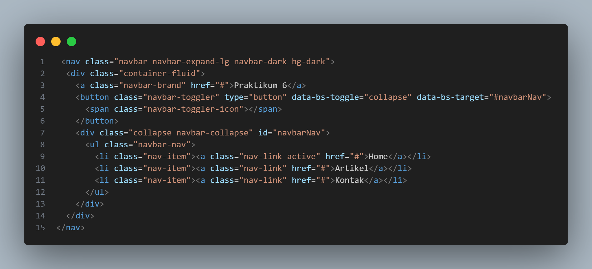
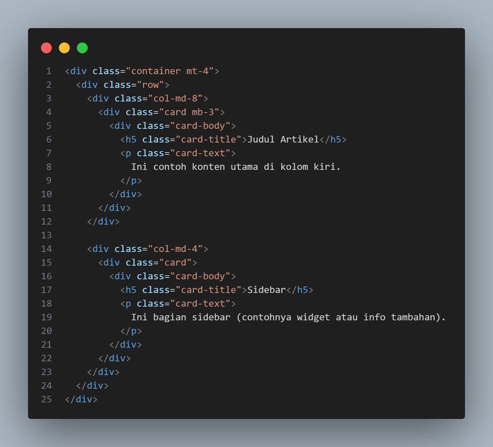
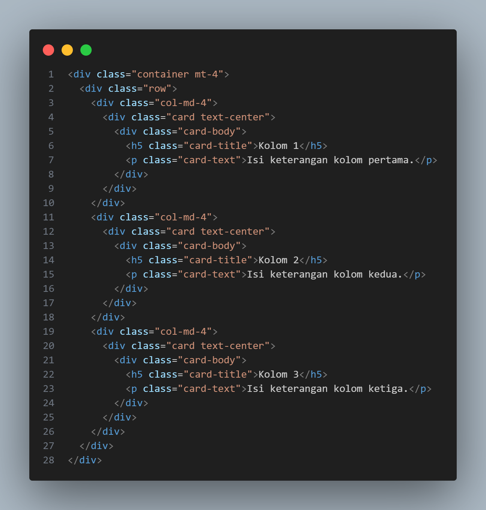
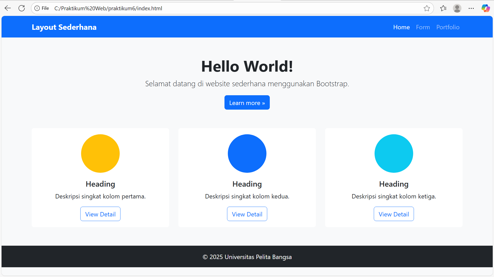
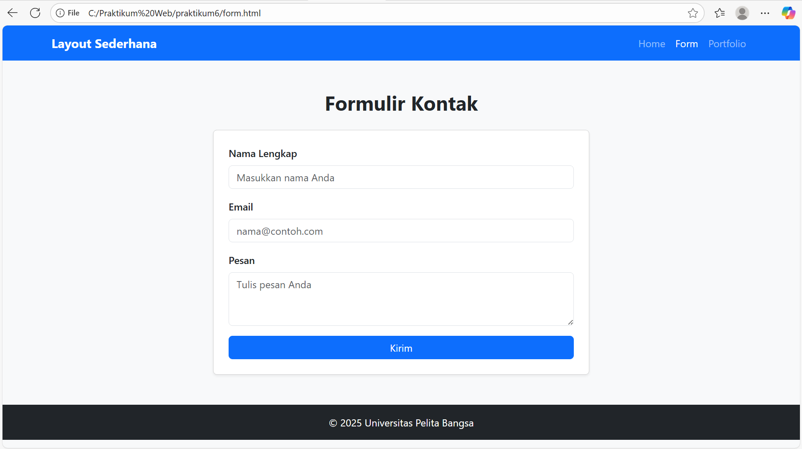
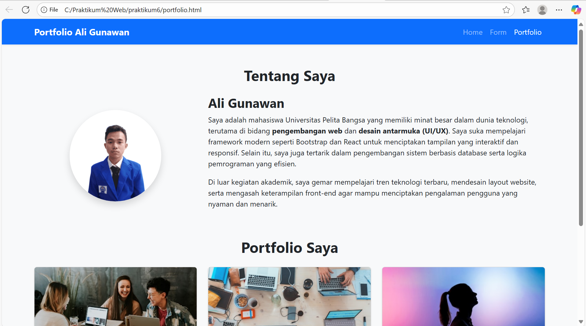
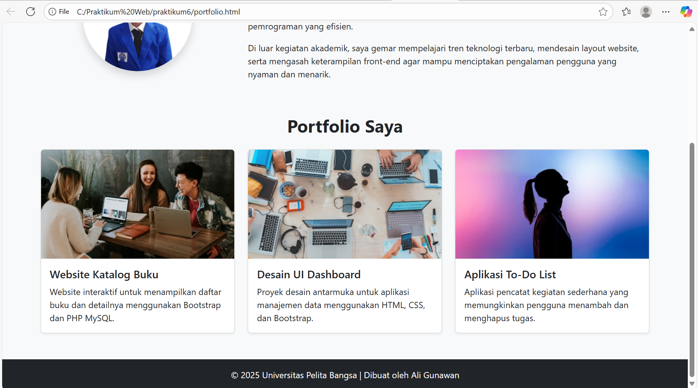

# LAPORAN PRAKTIKUM 6
DAFTAR ISI
==========
- [LAPORAN PRAKTIKUM 6](#laporan-praktikum-6) 
    - [TUJUAN PRAKTIKUM](#tujuan-praktikum)
    - [LANGKAH - LANGKAH MEMBUAT TWITTER BOOTSTRAP](#langkah-langkah-membuat-twitter-bootstrap)
    - [KESIMPULAN](#kesimpulan)

## TUJUAN PRAKTIKUM
Tujuan dari praktikum ini adalah untuk memahami cara menggunakan framework Bootstrap dalam membangun tampilan web yang modern, responsif, dan rapi tanpa harus menulis CSS dari awal.
Mahasiswa diharapkan dapat mengimplementasikan berbagai komponen seperti navbar, grid system, card, dan form dengan memanfaatkan class-class Bootstrap sehingga tampilan web menjadi lebih cepat dibuat dan tetap konsisten di berbagai ukuran layar.

## LANGKAH-LANGKAH MEMBUAT TWITTER BOOTSTRAP

### Step 1 Membuat struktur Dasar Index

# INPUT

### Step 2 Menambahkan Navbar Bootstrap 

# INPUT

### Step 3 Tambahkan Layout Grid (Main Content & Sidebar)

# INPUT

### Step 4 Menambahkan Heading Section (3 Kolom Card)

# INPUT

### Hasil Tampilan

# OUTPUT

  

### Step 1 Membuat Struktur Dasar Form

# INPUT

### Step 2 Menggunakan Navbar

# INPUT

### Step 3 Membuat form-nya dengan class Bootstrap

# INPUT

### Step 4 Menambahkan script Bootstrap di akhir body

# INPUT

### Hasil Tampilan

# OUTPUT

 

### Step 1 Membuat Struktur Dasar Portfolio

# INPUT

### Step 2 Menambahkan Navbar

# INPUT

### Step 3 Section “Tentang Saya”

# INPUT

### Step 4 Section “Portfolio Saya”

# INPUT

### Step 5 Menambahkan script Bootstrap di akhir body

# INPUT

# OUTPUT

## KESIMPULAN
Praktikum ini menunjukkan bagaimana Bootstrap mempercepat pembuatan layout web yang rapi dan responsif. Dengan memanfaatkan grid system, komponen siap pakai (navbar, card, form) serta utilitas spacing, mahasiswa dapat menyusun halaman portfolio profesional tanpa menulis banyak CSS. Struktur index.html, form.html, dan portfolio.html kini saling konsisten dan siap di-deploy.

